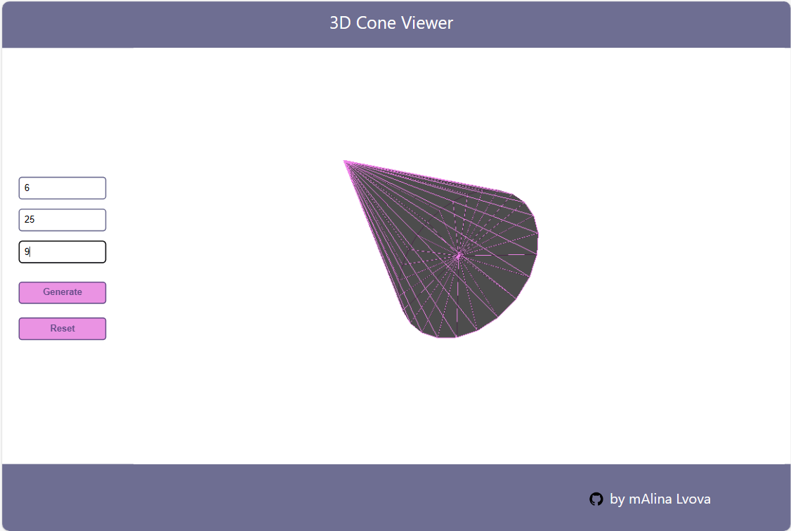

# 3D Cone Viewer

## Overview

This project is a client-server web application that allows users to create and visualize a simple cone in 3D. The application provides a 3D view of a cone based on user-defined parameters such as cone height, radius, and the number of segments on a circle. It utilizes WebGL and the three.js library for rendering the cone in a 3D space.




## Getting Started

To run the application locally, follow these steps:

1. Clone the repository to your local machine.

2. Navigate to the project directory in your terminal.

3. Install the required dependencies by running:

   ```bash
   npm install 
   ```

4. Start the server:
   
   ```bash
   npm run dev
   ```
   
   This will start the server at http://localhost:3001.

5. Open a new terminal window, navigate to the project directory, and start the client:

   ```bash
     npm start
   ```

   This will open the client application in your default web browser at http://localhost:3002.

## Usage

1. Once the application is running, you can access it in your web browser.

2. Enter the desired parameters for the cone:

   * Height (must be greater than 0)
   * Radius (must be greater than 0)
   * Number of Segments on a Circle (must be greater than 2)
     
3.Click the "Generate" button to send the parameters to the server for triangulation and display the cone.

4. To reset the parameters and remove the cone from the scene, click the "Reset" button.

## Implementation Details
* The application is a single-page application (SPA) with both front-end and back-end components.

* The back-end is implemented using Node.js, and it listens for incoming requests, specifically a POST request to "/computeConeTriangulation."

* Triangulation of the cone is performed on the server based on the provided parameters, and the resulting triangulation data is sent back to the client.

* The client renders the cone in 3D using the three.js library, creating triangles to represent the cone's surface.

* Memory leaks and excessive CPU usage have been minimized to ensure smooth usage of the application.

## Modifying Cone Parameters
You can modify the parameters of the cone and create different cone shapes in the 3D view. Adjust the height, radius, and the number of segments to explore various cone designs.

## Video Demonstration
For a video demonstration of the project's functionality, please watch the accompanying video.
The video file is located in the root of this repository.


Enjoy using the 3D Cone Viewer!
